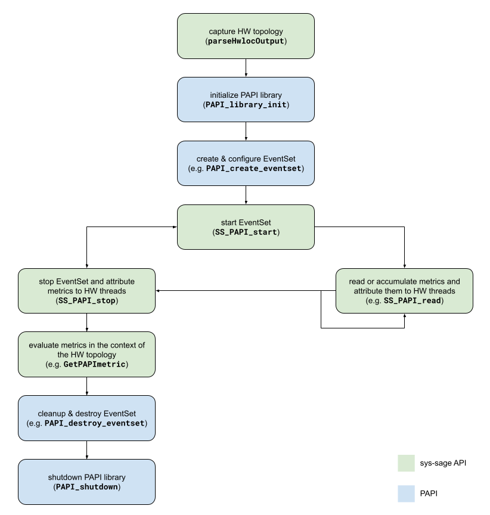

# PAPI Integration

The _sys-sage_ library provides routines corresponding to the known `PAPI_start`,
`PAPI_reset`, `PAPI_read`, `PAPI_accum` and `PAPI_stop` functions to capture
hardware performance counters on CPUs. The function signatures include

```cpp
int sys_sage::PAPI_start(int eventSet, PAPI_Metrics **metrics);

int sys_sage::PAPI_Metrics::PAPI_reset(int eventSet);

int sys_sage::PAPI_Metrics::PAPI_read(int eventSet, Component *root, bool permanent = false,
                                      unsigned long long *timestamp = nullptr);

int sys_sage::PAPI_Metrics::PAPI_accum(int eventSet, Component *root, bool permanent = false,
                                       unsigned long long *timestamp = nullptr);

int sys_sage::PAPI_Metrics::PAPI_stop(int eventSet, Component *root, bool permanent = false,
                                      unsigned long long *timestamp = nullptr);
```

The above functions offer a way to automatically integrate the performance
counter values into the _sys-sage_ topology, thus attributing the metrics
directly to the relevant hardware components and putting them into the context
of the overall hardware topology. They can be thought of as wrapper functions
around the actual PAPI routines.

The parameters and behavior of these wrappers will be explained in the following.

## General Workflow

The following diagram shows the overall workflow of the PAPI metrics collection
and evaluation through _sys-sage_:



The green boxes correspond to the _sys-sage_ API whereas the blue ones
correspond to plain PAPI. In general, the creation and configuration of event
sets remain with the original PAPI, while the performance monitoring is now
managed through _sys-sage_. An example of the basic usage can be found in the
`<path_to_sys-sage>/examples/papi_basics.cpp` file.

## Under the Hood

The routines `sys_sage::PAPI_Metrics::PAPI_read`, `sys_sage::PAPI_Metrics::PAPI_accum`
and `sys_sage::PAPI_Metrics::PAPI_stop` all follow a very similar strategy:

1. Based on the given event set, determine the events associated to it and
   store the event codes in a local array called `events`.

2. Perform the call to the underlying PAPI routine using a local array called
   `counters`.

   - `sys_sage::PAPI_Metrics::PAPI_read`  -> `PAPI_read`

   - `sys_sage::PAPI_Metrics::PAPI_accum` -> `PAPI_accum`

   - `sys_sage::PAPI_Metrics::PAPI_stop`  -> `PAPI_stop`

3. Depending on the event set, figure out to which hardware thread the counters
   belong to and find its ID. Here, we need to make a case destinction:

   - If the event set has explicitely been attached to a hardware thread,
     simply query for the ID through PAPI.

   - If the event set has explicitely been attached to a software thread, get
     the last known hardware thread on which it was scheduled on by reading
     `/proc/<tid>/stat`.

   - Otherwise, the event set is implicitely attached to the current software
     thread, in which case we simply call `sched_getcpu()`.

   In the last two cases, the software thread can potentially migrate across
   multiple hardware threads through repeated re-scheduling. Since PAPI uses
   `perf_event_open` internally, the Linux kernel will preserve the
   intermediate performance counter values across context switches. To "keep
   track" of these hardware threads and to attribute the performance counter
   values to them, _sys-sage_ uses a new relation type called `PAPI_Metrics`.

4. Together with the ID of the hardware thread, query for its handle in the
   _sys-sage_ topology. If the hardware thread is not already contained in the
   `PAPI_Metrics` object, it will be added to it.

5. Store the values of `counters` into the `attrib` map of the `PAPI_Metrics`
   object on a per-event basis, meaning that if the value `counters[i]` at
   index `i` corresponds to the event `events[i]`, we will have a key-value
   pair similar to `{ events[i], counters[i] }`. Note that the values are
   actually stored as entries of a datastructure and that the string
   representation of the event code is used as the actual key. This is a
   simplified overview and more detail is given below.

### Obtaining a `PAPI_Metrics` object

Normally, the user may gain access to a `PAPI_Metrics` object via the first
call to the `sys_sage::PAPI_start` wrapper function. The usage can be described
by the following code snippet:

```cpp
// `metrics == nullptr` signals the sys-sage library to create a new `PAPI_Metrics` object
sys_sage::PAPI_Metrics *metrics = nullptr;

sys_sage::PAPI_start(eventSet, &metrics);

// `metrics` points to a valid `PAPI_Metrics` object now

// do some performance monitoring...

// use plain PAPI to stop performance monitoring without caring for the values
PAPI_stop(eventSet, nullptr);

// do some performance analysis...

// reuse the `PAPI_Metrics` object
sys_sage::PAPI_start(eventSet, &metrics);
```

Note that a `PAPI_Metrics` object does not have to be bound to a single event
set. It's only used to store the perf counter values of an arbitrary event set
while also attributing these values to the hardware threads.

### Multiple Performance Counter Readings

We define a "performance counter reading" to be the act of fetching the current
values of the performance counters. It may be triggered by a call to either
`sys_sage::PAPI_Metrics::PAPI_read`, `sys_sage::PAPI_Metrics::PAPI_accum` or
`sys_sage::PAPI_Metrics::PAPI_stop`.

Now, the _sys-sage_ library allows the user to store the results of multiple
performance counter readings of the same event. To distinguish them from one
another, timestamps have been introduced which are recorded into `*timestamp`.
A timestamp is always associated to the entire reading, meaning that
performance counter values of different events share the same timestamp within
the same reading. It is important to state that these timestamps are **not**
guaranteed to be unique for every reading -- although most likely they will --
and in case of a collision, the value of the latter reading will be returned.

### Accessing Performance Counter Values

Since Linux uses the term "CPU" in terms of a logical processing unit, we use
"CPU" and "hardware thread" interchangeable in the following.

The `PAPI_Metrics` relation is able to distinguish perf counter values of one
CPU from another. The functions

```cpp
long long sys_sage::PAPI_Metrics::GetCpuPerfVal(int event, int cpuNum = -1,
                                                unsigned long long timestamp = 0);

sys_sage::CpuPerf *sys_sage::PAPI_Metrics::GetCpuPerf(int event, int cpuNum);
```

are at the user's disposal for accessing the perf counter values corresponding
to a specific event.

The `sys_sage::PAPI_Metrics::GetCpuPerfVal` function both offers a CPU-centric
view and an EventSet-centric view. That is, if `cpuNum != -1`, the counter
value of the desired CPU will be returned. Otherwise, the values of all CPUs in
the relation will be combined into a single output, offering a EventSet-centric
view which would be equal to the value that plain PAPI would return.
Furthermore, the `timestamp` parameter may be used to filter out the perf
counter value of a specific perf counter reading. A value of 0 refers to the
latest reading.

Moreover, the `sys_sage::PAPI_Metrics::GetCpuPerf` function returns a
datastructure containing all perf counter values of the corresponding CPU and
event.

### Rules for the Storage Mechanism of the Performance Counter Values

For the purpose of simplicity, we will focus on single-event event sets in this
section. Everything described here can be easilly extended on to multiple events.

Let's define the operations _READ_, _RESET_ and _ACCUM_, which correspond to
the respective PAPI routines. We have

- _READ_: capture the perf current counter value and store it

- _RESET_: set the perf counter to 0

- _ACCUM_: capture the current value of the perf counter, add it to some data,
           and perform the _RESET_ operation

Furthermore, each entry of the datastructure containing the perf counter values
can be either in the _permanent_ or _temporary_ mode (indicated by the `permanent`
parameter). If an entry is temporary, it may be overwritten by some new perf
counter reading. If it is permanent, it may not be modified again, and
therefore a new entry must be added to the datastructure.

Now, the rules are as follows:

1. If a _READ_ operation supersedes a _RESET_ operation, all temporary entries
   of all CPUs of that specific event will be deleted.

2. If there are no more entries in the datastructure of a CPU, that CPU will
   be removed from the relation.

3. The value extracted from a _READ_ operation will be "split" among all CPUs
   whose latest entry is temporary and contains a value that stems from the
   latest reading.

If $x$ is the value gained from a _READ_ operation on CPU $a$ and $y$ is the
sum of values of all CPUs in the relation that satisfy the above conditions,
then the result $z := x - y$ is stored in an entry corresponding to CPU $a$.

4. The value extracted from an _ACCUM_ operation will be "merged" with all CPUs
   whose latest entry is permanent and contains a value that stems from the
   latest reading.

If $x$ is the value gained from an _ACCUM_ operation on CPU $a$ and $y$ is the
sum of values of all CPUs in the relation that satisfy the above conditions,
then the result $z := x + y$ is stored in an entry corresponding to CPU $a$.

## Error Handling

The error codes of PAPI have been adopted to maintain consistency.
